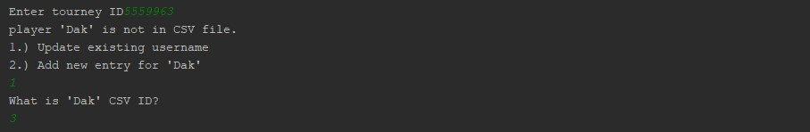

# Elo-Rating-System-for-Challonge-Tournaments
Easy way to track rankings for local eSport gaming scenes. This program is written in python and utilizes the Challonge API
and requests library to gather tournament information from https://Challonge.com and generate a .csv file for all your players. The 
Elo-Rating system is based on a zero-sum game, and additionally does not support any other kinds of scoring other than one versus one 
matches. It was initially popularized by Chess, but has many applications in other games. I created this to support my Super Smash Bros. 
eSport club at my college.

## Disclaimers
1.) The math behind determining scores is based on this Wiki article (https://en.wikipedia.org/wiki/Elo_rating_system),
and is in no way the one best way to represent skill level.

2.) Ensure any participant names do not contain the following characters:
| - bar
' - single quote
, - comma

## Utilization
Upon cloning the repository, you will also need a config.py file. Inside this file simply include your Challonge username and API key,
which can be found here: https://challonge.com/settings/developer

It should look like this:
```python
username = 'JohnDoe'
apiKey = 'xxxxxx...'
```

After this is done, here are the simple steps:

1.) For each tournament, first run 'GetTourneyID.py'. It will return a list of all the tournaments hosted on your account. Copy the ID of
the tournament you want to score.

2.) Next, run 'VerifyPlayers.py'. This will check the names of the current tournament vs. the names in your EloRatings.csv file.
If a name is not yet in the .csv file, you can enter '2' to add it (This will be the case for ALL names in the first tourney you run).
If you run future tournaments and someone has entered with a new name, when the program detects the name is new, enter '1' instead to update
their new alias. It will then ask for the players ID in your .csv file who's name should be updated. 
Make sure VerifyPlayers completes before running a tournament. Here is what the program looks like for each player:


3.) Finally, run 'RunTourney.py' and enter the same tournament ID as before. After this is done, your CSV file will contain your new rankings.
To easily see the ranks in order, you can open the .csv file in excel.

